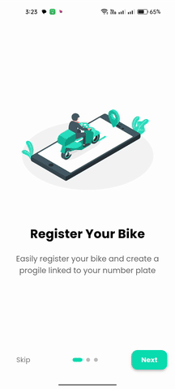
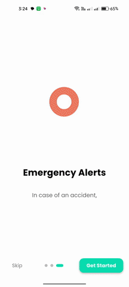
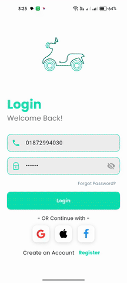
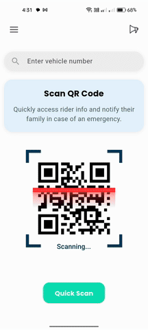

# 🛡️ Rider Safety App(Rider ResQ🏍️) 

## 🚨 Problem Statement
In road accidents involving motorbikes, it's often difficult to identify the rider and quickly notify their family or emergency services. Many victims remain unidentified for crucial hours, delaying medical attention and emotional support. Additionally, when a temporary rider borrows a bike, there's often no clear way to trace who was riding it. In such emergencies, real-time identity verification and community help become essential.

## 💡 Solution
This app helps solve the problem by allowing riders to register their identity linked to their number plate. It generates a QR code that can be printed and attached to their bike. When an accident occurs, anyone can scan the code or search the number plate to:

- Access rider/emergency contact information
- Report the incident in the community
- Notify nearby hospitals or police
- Track the incident in a centralized community thread

It also supports a temporary rider feature and real-time status updates where the rider can mark themselves as safe.

---

## 🚀 Features Overview

### ✅ Onboarding Screens
- 3 intro screens guiding users through the key features of the app
- 

### 🔐 Login & Registration Pages
- Rider signs in with basic information
- Profile setup includes number plate, emergency contact, and optional data
- 

### 🏠 Home Page
- Search bar to look up number plates
- Notification icon (alerts for new incidents)
- Quick QR scanner for emergency access
- 

### 📂 Navigation Drawer Includes:
- **Edit Profile**: Modify rider or emergency contact details
- **Generate QR Code**: Create a printable QR for bike attachment
- **Community**: Browse incident threads, post updates, comment, mark as safe
- **Nearby**: Placeholder for future hospital, ambulance, or police alerts
- **Temporary Rider**: Register someone borrowing your bike
- **Select Language**: Multi-language support option
- **Notifications**: Full list of alerts and community messages
- **Logout**: Secure sign out
- 

---

## 🛠️ Future Enhancements
- Firebase integration for real-time sync
- Location-based emergency service alerts
- Push notifications
- Admin panel for verifying incident reports

## 📦 Project Structure Suggestion

---

## 👨‍💻 Tech Stack
- **Flutter** (Frontend)
- **Dart** (Language)
- **Firebase** (Planned for Auth + Database)

---

## ✨ Credits
Built with ❤️ to save lives and bring tech into road safety for two-wheelers.

---

## 👥 Team: Sust_Brainstormers

### Team Members:

- **Member 1: Kawsar Ahmmed Hridoy**  
  **Role:** Team Leader, UI/UX Design, App Development (Frontend), Research

- **Member 2: Md. Shawon Hossan**  
  **Role:** App Development (Frontend & Backend), UI/UX Design, Research

- **Member 3: Md. Redwan Hasan**  
  **Role:** Research, Content Creation, Robotics

- **Member 4: Abu Sayed Sawon**  
  **Role:** Research, Script Writing, Machine Learning, Coordination
